# Cat's Cradle - A String Looping Exercise

### Introduction

Let's do some really advanced looping, using string indices. Hopefully you won't get quite as loopy with strings as these people:

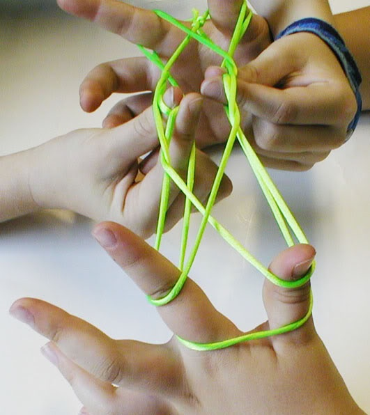

### Background

Indices are just numbers, and if we use a counter variable, we can simply access any indices we want in a loop.

If you have a loop like this:

``` javascript
const str = 'Hello!';
let counter = 0;
while(counter < 3) {
  console.log(str);
  counter = counter + 1;
}
```

then you'll print the string out three times (once when `coutner` is 0, once when it's 1, once when it's 2).

But if you wanted to print out each of the characters in the string, you could do this:

``` javascript
const str = 'Hello!';
let counter = 0;
while(counter < str.length) {
  console.log(str[counter]);
  counter = counter + 1;
}
```
We've only changed two things: told the loop to go until teh counter is at the end of the string (in the condition of the loop), and printed the character of the string instead of the whole string, using counter as an index ( where we pass a value into the console.log call)

You'll be putting your loops into functions like a good programmer should, but otherwise, we'll be doing variations on this theme. How can we manipulate how the counter changes, its starting point, and its end point, to hit the string in different and interesting ways that elucidate how loops and indices play together? Let's find out!
### Workflow

This is NOT a test-driven assignment, but we WILL be writing everything in functions. Then we will be calling each of those functions below their definition, so that when we run `node main.js` and execute the code, we can see what gets printed. Let's solve an imaginary first one together as an example!

When you're given the following instruction:

"1): write a function that loops from the first index to the last of the given string, printing each character.""

You would write the below code: 

```javascript

function challenge1(str) {
  let i = 0;
  while (i < str.length) {
    console.log(str[i]);
    i = i + 1;
  }
}

challenge1('Hello.');
challenge1('Oh hi.');
```

(Ignore the line with the word "javascript" on it if you're reading the straight markdown; together with the  surrounding triple backticks, that adds syntax coloration in the web version. Feel free to check out the README on GitHub to see!)

Now when we call `node main.js` in our terminal, we'll see an 'H' printed there, followed by an 'e', followed by an 'l', and so on all the way through both strings. Then we know we did it right!

And that's how you'll do each of these challenges.


### A Note On Challenge Difficulty

There are many challenges below, and they get very difficult. This is another assignment that is absolutely fantastic to return to if (when) you don't finish it. Do as many as you can! They each have variations on how to loop through indices that will teach you something new.


### Some General Hints

* Commenting out your previous function calls can help keep your terminal output readable and clean.
* Feel free to jump around if you get stumped for too long on one. And research isn't cheating!
* Pay careful attention to the parameters each function is being asked to take in, as well as each's example output.


### Challenges

1) Write a function that loops from the first index to the last of the given string, printing each character. Call it with "Hello." and call it again with "Oh hi."

Example output:

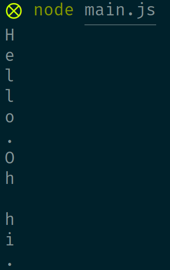

2) Write a function that prints out every third character. **HINT:** you'll need to play with how our counter/index variable changes with each loop.

Now call it with "I am the alfalfa and the omelette." An "e" should be the last thing printed, with no `undefined` values showing up.

Example output:

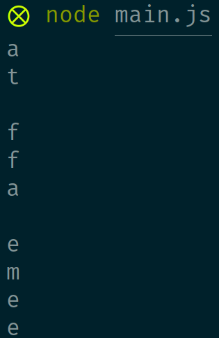

3) Write a function that loops from the **last** index to the **first** of the given string, printing each character; in other words, print all the characters individually, but backwards. Call it with "Hello." and call it again with "Oh hi."

Example output:

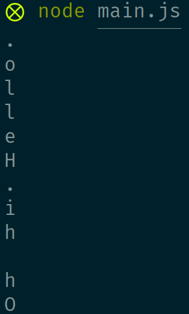

4) Write a function that prints out only the vowels from a given string. Do not use regular expressions ("regex"). Now call it with "Regular expressions are for term 2.". You should see an "e" printed, followed by a "u", followed by an "a", and so on. **HINT**: you can check if each charater is a vowel by checking if it `===` 'a' and 'e' and so on. Or you could check out `.includes`, but if you stretch out into `.includes`, make sure you don't get it backwards. It's very easy to accidentally check if the string of vowels ('aeiou') is IN a single character, rather than the other way around!

Example output:

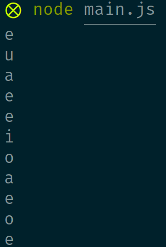

5) Write a function that prints all characters from a certain index until the end of the string. It should take in two parameters: a string, and a number representing a starting point index from which to begin printing that string. Now call it with 'slaughter' and `1`, and then again with "I don't love you!" and `7`.

Example output:

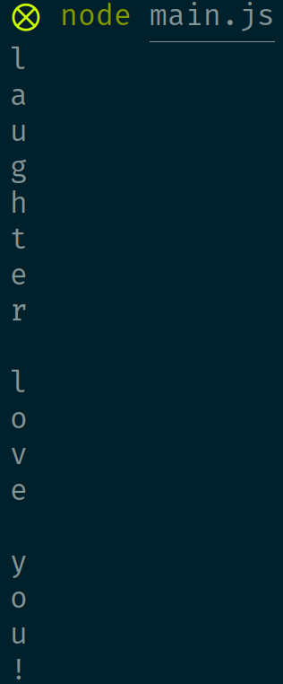

6) Write a function that prints out the index of every `u` it finds in the given string. Do not use `indexOf`. Now call it with `'You picked the wrong house, bub.'`.

Example output:

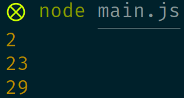

7) Write a function that prints out only the first 5 vowels from the given string. Continue to not use regexes. Now call it with "Regular expressions are for term 2.". Now call it again with "Hello". (It should print out all the vowels in a string if given a string with fewer than 5.)

Example output:

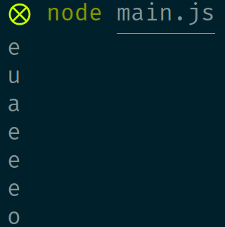

8) Write a function that prints out the only the first index of the letter `u` in the given string. Do not use `indexOf`. Now call it with 'You picked the wrong house, bub.'

Example output:

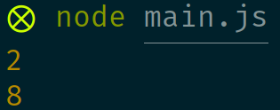

9) Write a function that prints out the first four characters after the given index in the given string, or, if there are fewer than 4 characters remaining, prints only the remaining ones. Now call it with 'Oh hi, I didn't see you there. Welcome.' and `4` as your parameters. Now call it again with 'Oh hi, I didn't see you there. Welcome.' and `36` as your parameters.

Example output:

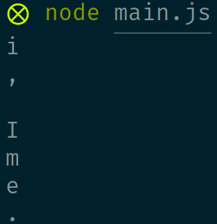

10) Write a function that prints out the first index of the letter `u` in the given string, with a `-1` printed if it doesn't find it. Do not use `indexOf`. Now call it with 'You picked the wrong house, bub.' Now call it again with "I'm Canadian."

Example output:

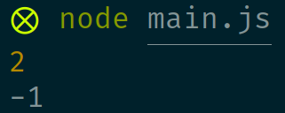

